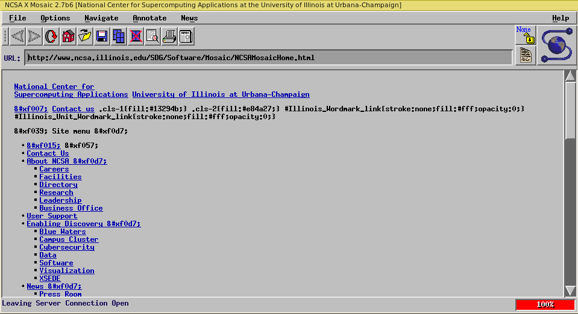
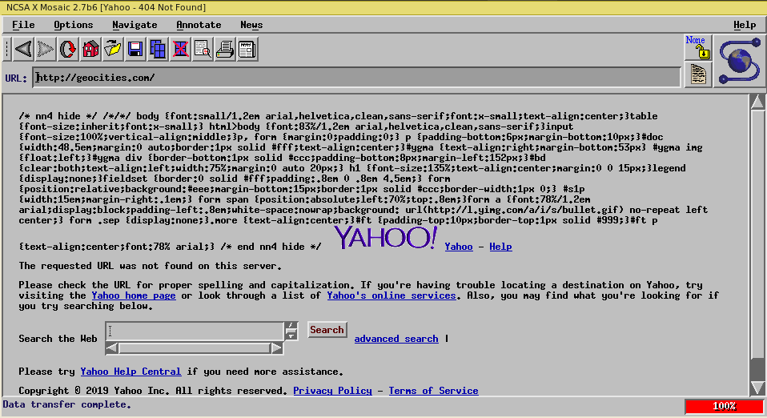

# Docker image for NCSA Mosaic

Mosaic binary in a docker container - Feel the future of yesterday

To run on local X window, the latest version of NCSA (yes, the one from 1997! 2.7b6), just type:

```sh
 docker run -d --rm -e DISPLAY=:0 -v /tmp/.X11-unix:/tmp/.X11-unix --name=ncsa-mosaic gissehel/mosaic
```




